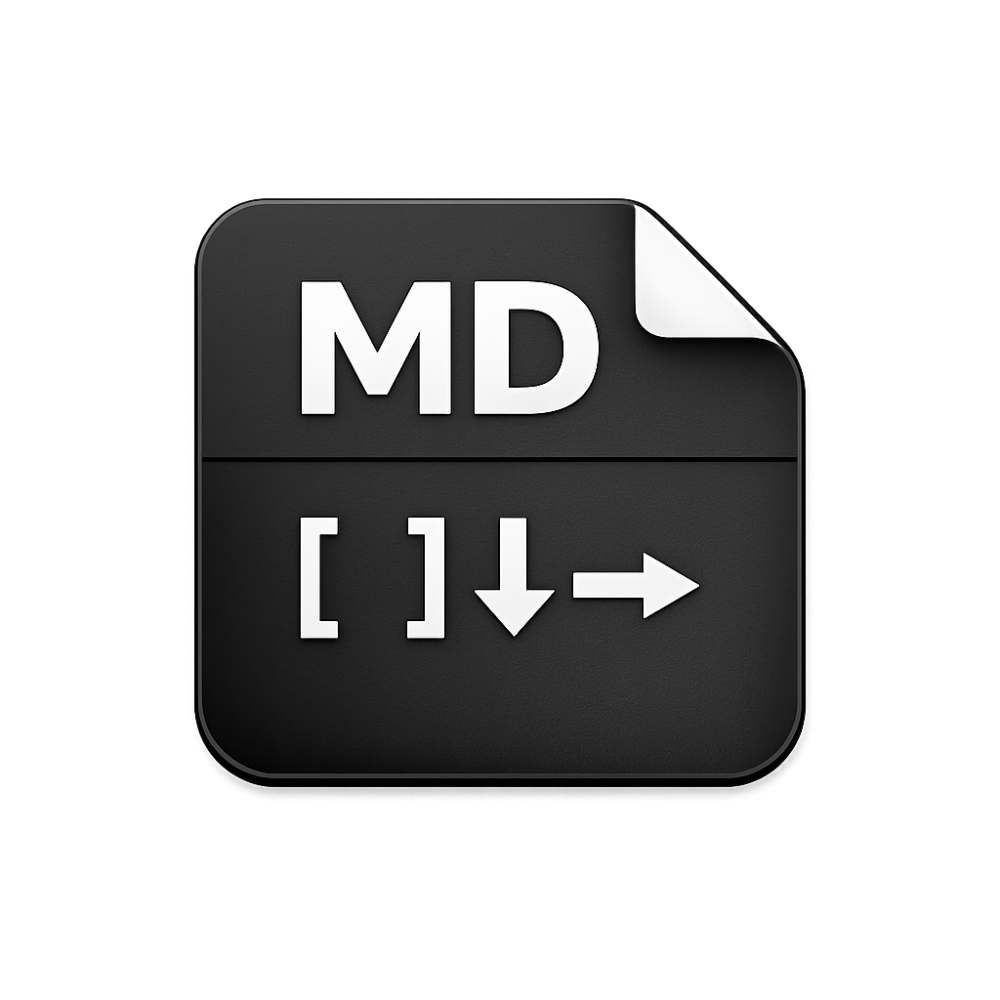
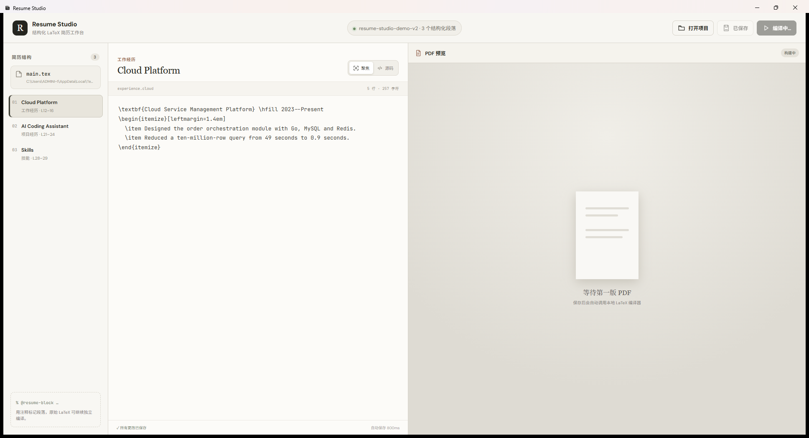
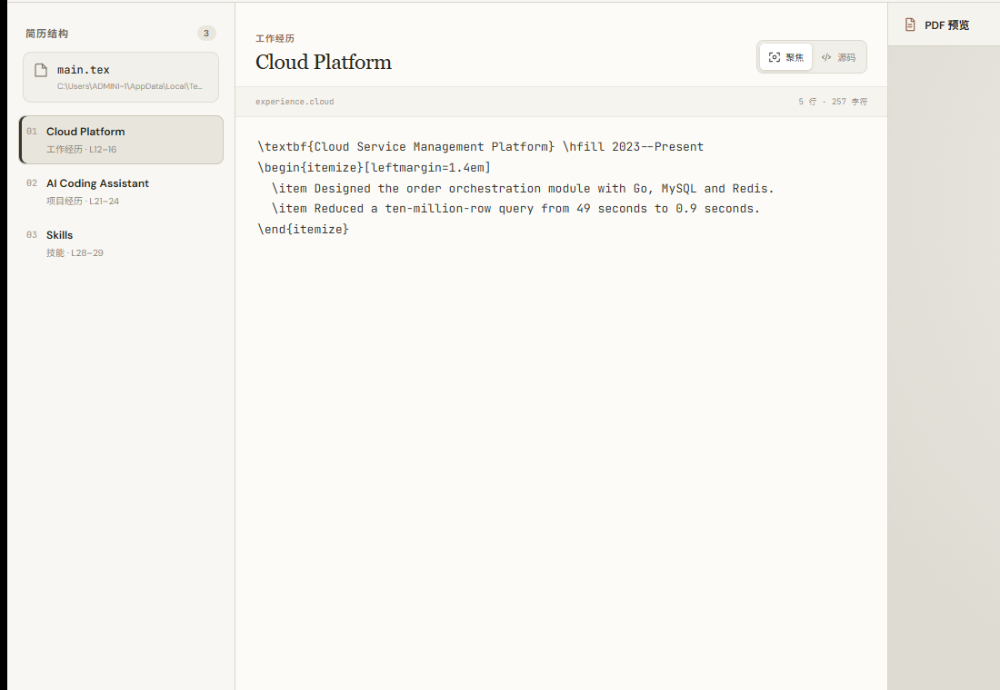

<p align="center">
  
</p>

<h1 align="center">TeXFlow · Resume Studio</h1>

<p align="center">
  面向简历场景的 local-first LaTeX 工作台：用结构化段落专注修改内容，同时保留完整源码和实时 PDF 编译能力。
</p>

<p align="center">
  <strong>Wails 3</strong> · <strong>Go</strong> · <strong>React</strong> · <strong>TypeScript</strong> · <strong>Tectonic</strong>
</p>



## 为什么做 TeXFlow

通用 LaTeX 编辑器更关注源码文件，而修改简历时，人真正关心的是某段工作经历、项目描述或技能列表。TeXFlow 在不改变 LaTeX 文件可移植性的前提下，用注释标记建立“简历结构树 → 当前段落 → PDF”的工作流。

## 核心能力

| 能力 | 说明 |
| --- | --- |
| 结构化段落 | 扫描 `@resume-block` 注释，生成工作经历、项目、技能等结构树 |
| 聚焦编辑 | 只编辑当前段落，减少长文档中的视觉干扰 |
| 完整源码 | 随时切换回 `.tex` 完整源文件，不锁定模板和宏包 |
| 自动保存 | 停止输入 800ms 后原子写回源文件 |
| 自动编译 | 依次探测 `latexmk`、Tectonic、`xelatex`，选择可用引擎 |
| 稳定预览 | 编译失败时保留上一版成功 PDF，不让预览突然消失 |
| 编译调度 | 取消旧任务并丢弃乱序结果，避免快速输入时预览回退 |
| 错误诊断 | 从编译日志中提取文件、行号和错误信息 |
| 静默编译 | Windows 下所有 LaTeX 子进程使用无窗口模式，不弹出 CMD 窗口 |

### 聚焦编辑



左侧选择一个 ResumeBlock，中间只呈现对应 LaTeX 片段；保存时按原始文件偏移安全替换，不要求用户改用私有文档格式。

## ResumeBlock 标记

在现有简历中加入两行 LaTeX 注释即可：

```latex
% @resume-block id=experience.cloud type=experience title="云平台项目"
\textbf{云服务管理平台}
\begin{itemize}
  \item 负责订单模块设计与研发……
  \item 将千万级查询耗时从 49 秒优化至 0.9 秒……
\end{itemize}
% @end-resume-block
```

- `id`：段落唯一标识，必填。
- `type`：段落类型，可选，例如 `experience`、`project`、`education`、`skills`。
- `title`：结构树展示名称，可选；省略时根据 `id` 自动生成。
- 标记本身是普通 LaTeX 注释，文件仍可脱离 TeXFlow 独立编译。

## 快速开始

### 直接运行

Windows 构建产物位于：

```text
bin/
├── ResumeStudio.exe
└── tools/
    └── tectonic.exe
```

运行 `ResumeStudio.exe` 即可。分发时需要保留 `tools` 子目录。

首次启动会载入示例简历；点击“打开项目”可以选择自己的 LaTeX 目录。程序优先寻找 `main.tex`，若不存在则选择目录中的第一个 `.tex` 文件。

### 从源码运行

要求：

- Go 1.25+
- Node.js 与 npm
- Microsoft WebView2
- Wails 3 CLI

```powershell
go install github.com/wailsapp/wails/v3/cmd/wails3@latest
git clone https://github.com/chengmingchun/TeXFlow.git
cd TeXFlow
wails3 dev
```

## 构建

```powershell
# 完整生产构建
.\build.ps1

# 等价命令
wails3 build
```

构建流程会：

1. 使用根目录的 `ico.png` 生成 Windows/macOS 平台图标；
2. 生成 Wails 3 TypeScript bindings；
3. 构建 React 前端和 Go 桌面程序；
4. 下载并复制 Tectonic 0.16.9 到 `bin/tools/tectonic.exe`。

如果系统已经安装 `latexmk + xelatex`，TeXFlow 会优先使用系统工具。否则使用随应用携带的 Tectonic。Tectonic 首次编译需要联网按需下载 TeX 资源，此后使用用户目录中的缓存；Windows 系统代理会自动传递给编译进程。

## 架构

```text
React UI
├── Resume Outline
├── Focus / Source Editor
├── PDF Preview
└── Diagnostics
        │ Wails 3 bindings
Go Application
├── ResumeBlock Parser
├── Atomic File Writer
├── Compile Coordinator
└── Engine Resolver
        ├── latexmk + XeLaTeX
        ├── bundled Tectonic
        └── system xelatex
```

## 项目结构

```text
.
├── app.go                    # Wails 服务与项目读写
├── blocks.go                 # ResumeBlock 解析
├── compiler.go               # 编译调度和日志解析
├── compiler_env_windows.go   # Windows 代理继承
├── frontend/src/             # React 工作台
├── scripts/                  # Tectonic 安装、README 截图脚本
├── build/                    # Wails 3 平台构建资源
├── ico.png                   # 构建图标源文件
└── Taskfile.yml              # Wails 3 构建任务
```

## 验证

```powershell
go test ./...
cd frontend
npm run build
```

当前测试覆盖 ResumeBlock 解析、非法标记检测、段落保存往返以及内置 Tectonic 探测。

## 路线图

- [ ] SyncTeX：源码到 PDF 的精确定位和反向跳转
- [ ] Monaco Editor：LaTeX 高亮、错误标记与 Diff
- [ ] AI 局部改写：围绕当前 ResumeBlock 提供可确认的差异视图
- [ ] JD 匹配和多岗位简历版本
- [ ] Git 式版本历史与模板管理

## 当前限制

- PDF 预览目前依赖 WebView2 内置查看器。
- 多文件项目当前只编辑主 `.tex` 文件，其他资源保持原样。
- Tectonic 首次使用依赖网络；复杂中文模板更推荐完整 TeX Live 环境。

## License

项目暂未指定开源许可证。正式公开分发前建议补充 `LICENSE` 文件。
